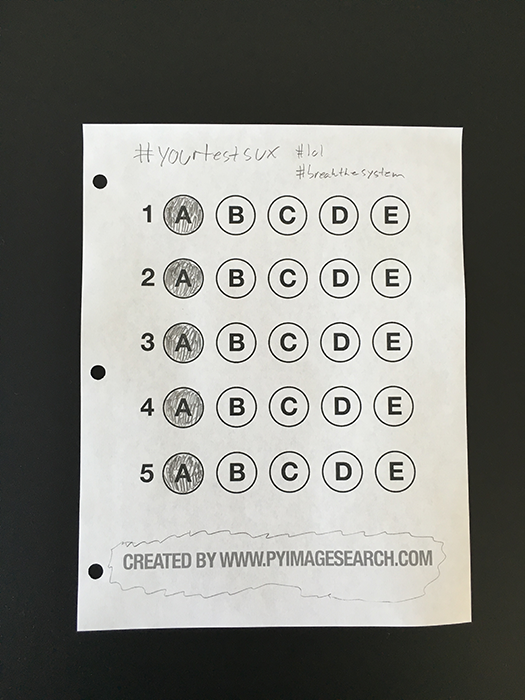
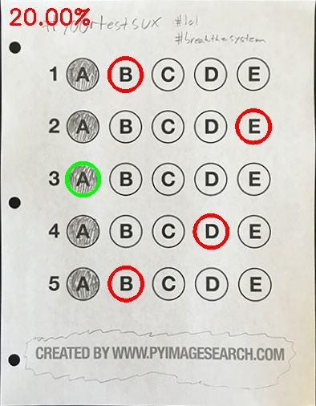
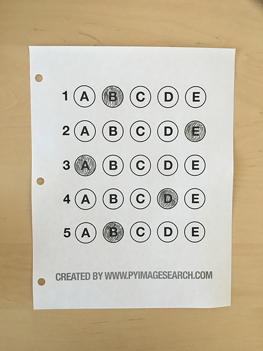
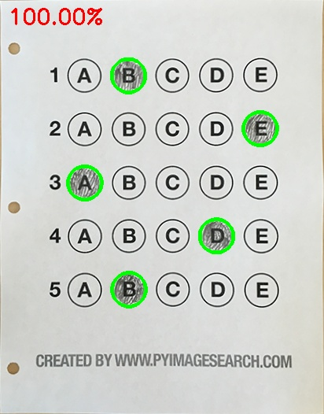

# OMR Scanner and Test Grader using OpenCV
### Scans an OMR and Grades the responses

Awesome OMR Scanner and Grader using just OpenCV and Python

All thanks to Adrian Rosebrock (from [pyimagesearch](https://www.pyimagesearch.com/)) for making
great tutorials. This project is inspired from his blog: [Bubble sheet multiple choice scanner and test grader using OMR, Python and OpenCV](https://www.pyimagesearch.com/2016/10/03/bubble-sheet-multiple-choice-scanner-and-test-grader-using-omr-python-and-opencv/). I have included the author's code and the one i wrote my self as well.

## **Key Points**
1. Combines the following techniques:
    1. [Building document scanner](https://github.com/practical-cv/Document-Scanner)
    2. Sorting the contours
    3. Perspective transform to get top-down view
2. Steps involved:
    1. Detect the OMR sheet
    2. Apply perspective transform to get the top-down view of the sheet
    3. Extract out all the bubbles in the sheet
    4. Sort them in rows
    5. Determine the answer bubble for each row
    6. Match with the correct answer
    7. Do this for all questions (all rows)
2. Assumptions:
    1. The app assumes that the OMR document we are scanning is the main focus of the image.
    2. All 4 edges of the OMR document are visible in the image.
    3. The largest rectangle available in the image will be the OMR document. 
3. Stored the correct answer keys in a dict in python.
4. Used Canny edge detection for detecting the edges in the document and Gussian blur for reducing high frequency noise.
5. OpenCV has the way to get the top-down view of the image. Used that methodology to get the top-down view.
6. Used Otsu’s thresholding method for thresholding.
7. Determined the bubbles using the aspect ratio of approx one (1) for it's bounding rectangle.
8. Used bitwise operations and masking to find the filled in bubble using the amount of shaded pixels in the bubble.

 ## **Requirements: (with versions i tested on)**
 1. python          (3.7.3)
 2. opencv          (4.1.0)
 3. numpy           (1.61.4)
 4. imutils         (0.5.2)

 ## **Commands to run the detection:**
 ```
 python test_grader.py --image images/test_02.png
```


## **Results:**
The results are pretty amazing. The grading system is working perfectly fine.

**input**
___


**Output**
___


**input**
___


**Output**
___



## **The limitations**
1. There is no logic to handle non-filled bubbles. (This can be solved by using a threshold value for marking a bubble as filled)
2. Multiple bubbles marking is not handled. (This can also be solved using a threshold for marking bubble as filled and counting the number and position of filled bubbles)
